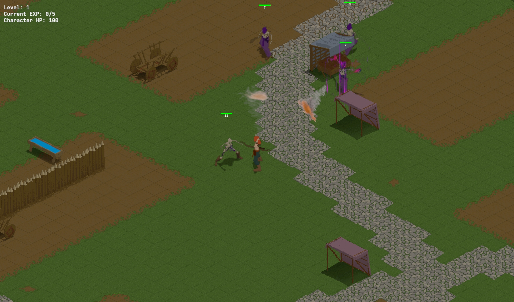
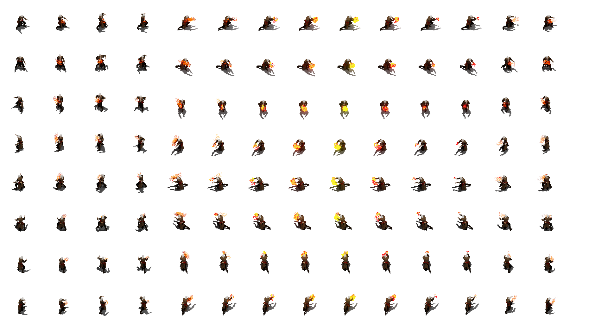

# Kill'em All.io

An isometric horde-survival slasher with character progression — fight waves, level up, pick upgrades, and see how long you can last. **Demo v0.5**: alpha build with core combat in place; tutorial is minimal by design.

**[Play on EdenSpark →](https://edenspark.io)** · **[Source on GitHub →](https://github.com/MarySueXLsD/Kill-em-All.io)**

## About

Kill'em All.io is a top-down isometric action game in the `.io` mold: you move through a combat arena, cut through enemy waves, earn experience, and choose upgrades that reshape your build. Swap between a sprawling combat map (`level_1`) and a compact hub (`base`) as the loop grows.

**What you'll do**

- **Move and fight** — WASD to move, mouse to aim, slash and shoot through skeletons, barbarians, and bosses
- **Dash and swap weapons** — Space to dash, E/Q to switch melee and ranged
- **Level up mid-run** — pick from randomized upgrades (damage, speed, crit, life steal, AOE, and more)
- **Survive escalating waves** — enemy AI, projectiles, and boss encounters ramp up the longer you hold the line

**Features**

- Isometric grid combat with sword, bow, and special abilities
- Upgrade picker with 15+ build modifiers
- Hub + arena level switching
- Pixel-art characters and props with depth-sorted isometric rendering
- Disclaimer screen, staged loading, and full in-game HUD

> This is an early alpha: some mechanics are in, others are still being wired up. There is no hand-holding tutorial — read the controls below or experiment.

## Controls

| Input | Action |
| --- | --- |
| WASD | Move |
| Shift | Run |
| Space | Dash |
| Mouse | Aim / attack |
| E / Q | Switch weapon |
| 1 / 2 / 3 | Upgrade choice (on level-up) |

## Screenshots

<table>
<tr>
<td width="50%">

<b>Combat arena</b> — Isometric horde combat on the main map. Waves close in from all sides.

</td>
<td width="50%">

<b>Kreol</b> — The playable character, built for fast movement and dual-weapon combat.

</td>
</tr>
</table>

## EdenSpark

This game is built with **[EdenSpark](https://edenspark.io)** using **Gen2 daScript** (Daslang). EdenSpark is an AI-assisted game creation platform and engine for building and publishing playable projects from the Eden launcher.

Kill'em All.io is an independent EdenSpark project — a work-in-progress `.io` slasher exploring horde survival, procedural-feeling upgrade builds, and isometric action on the engine.

## Credits

| Role | Name |
| --- | --- |
| Game designer / programmer | Viktar Syanau (MarySue) |

## Development

**Requirements:** [EdenSpark Launcher](https://edenspark.io) with this project in your Eden projects folder.

**Open the project**

1. Install EdenSpark Launcher
2. Clone this repository into your Eden projects directory
3. Open the project from the launcher (ID `019ed1ae-4c54-720c-b8a6-52d62157ca6a`) and press Play

### Project layout

| Path | Role |
| --- | --- |
| [`main.das`](main.das) | Engine entry — lifecycle hooks, cheats, frame orchestration |
| [`scripts/das/`](scripts/das/) | Game logic (core, world, combat, ui, debug) |
| [`scripts/python/`](scripts/python/) | Prefab bake and asset pipeline |
| [`prefabs/`](prefabs/) | `level_1.prefab`, `base.prefab` |
| [`static/`](static/) | Textures and sprites |
| [`docs/`](docs/) | Technical documentation |

### Documentation

- [Architecture](docs/ARCHITECTURE.md) — boot flow, update order, module layers
- [Modules](docs/MODULES.md) — per-file responsibilities
- [Constants](docs/CONSTANTS.md) — tunables and where to edit them
- [Tools](docs/TOOLS.md) — Python tooling overview
- [Level authoring](docs/LEVEL_AUTHORING.md) — prefab editing and rebake workflow
