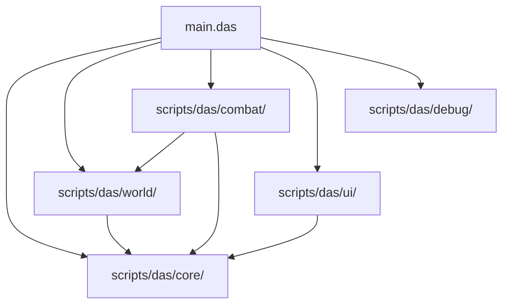
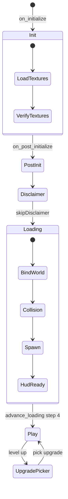
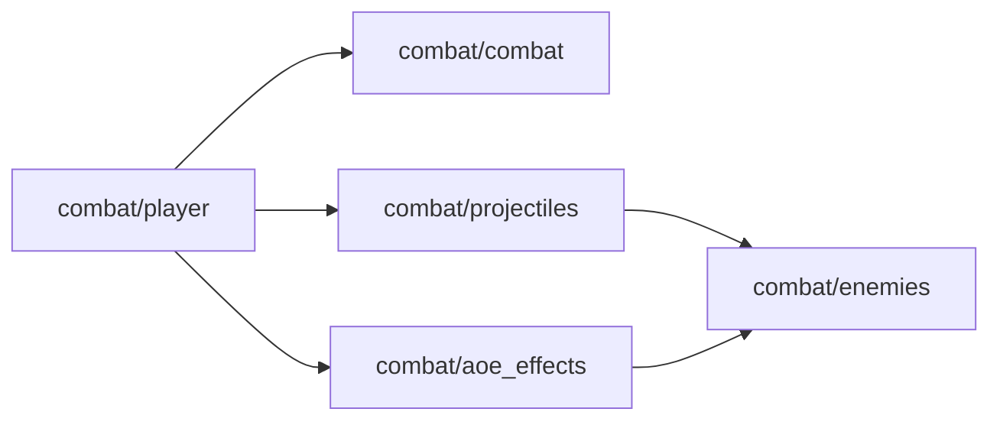

# Architecture

## Module layers

**Rules**

- Only `main.das` declares `[export]` engine hooks and `[cheat]` commands.
- Domain code uses `module X public` facades where split (e.g. `enemies`, `world`, `props`).
- Cross-module state lives in [`scripts/das/core/game_state.das`](../scripts/das/core/game_state.das).
- Tunables live in [`scripts/das/core/constants.das`](../scripts/das/core/constants.das) (aggregator over `constants_*.das`).
- `plugin.das_project` resolves `require core/...` etc. under `scripts/das/`.

## Boot flow

**Texture loading** uses memory-budget decoding in [`scripts/das/world/prefab_texture_hydrate.das`](../scripts/das/world/prefab_texture_hydrate.das): each frame reads `heap_bytes_allocated()` and loads as many textures as fit under the 100 MiB Eden heap cap (with a safety margin and ~8 MiB decode headroom for character sprite sheets). Small env/UI textures may load in bursts; the loader waits instead of skipping when memory is tight.

**Loading steps** in [`scripts/das/ui/loading.das`](../scripts/das/ui/loading.das):

1. Hydrate prefab sprites in batches (`Binding world... N%`)
2. Load terrain textures and build map geometry
3. Load UI textures incrementally
4. Collision + effects root
5. Stream remaining assets (`Loading assets... N left, X% heap`) — props, combat animations, boss/AoE
6. Bind prop sprites, spawn player and enemies
7. HUD + `gameReady`

Prefab sprites are hydrated first; procedural map/prop overlays run when terrain textures are ready. Use cheat `level.memory_status` to inspect heap usage during loading.

## Frame update order (`main.das` → `on_update`)

When `gameReady` and upgrade picker is inactive:

1. Enemy frame cache stamp
2. Player world position sync
3. EXP popup flush
4. Debug / tile-angle tuning
5. Camera ortho + follow
6. Map + prop visibility (skipped while dashing)
7. Dash ghosts, enemy spawn, death-knight boss
8. Enemy health bar positions
9. EXP popups + player health HUD
10. Debug hitbox draw

Resolution changes trigger HUD relayout and map visibility cache invalidation in `on_resolution_changed`.

## Combat data flow

