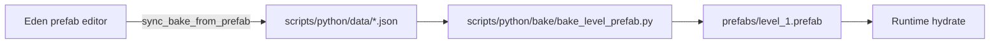

# Python tools

See also [`scripts/python/README.md`](../scripts/python/README.md) for a command cheat sheet.

## Pipeline overview



## Folders

- **`lib/`** — `grass_overlay`, `wall_placement`, `map_layers_io`, `resource_link_hash`, `das_constants`
- **`data/`** — chunked `level_1_map_layers_*.json`, `level_1_prop_crops.json`, `level_1_prop_markers.json`, `texture_ref_ids.json`
- **`bake/`** — `bake_level_prefab.py`, `bake_base_prefab.py`
- **`prefab/`** — sync, patch, fix UID, hydrate scripts
- **`assets/`** — PNG optimize/crop/pad
- **`analyze/`** — inspection helpers

## Typical workflows

### Rebake level from data

```bash
python scripts/python/bake/bake_level_prefab.py
python scripts/python/prefab/fix_prefab_pick_uids.py   # if hand-editing pick order
```

### Edit in editor, sync data back

```bash
python scripts/python/prefab/sync_bake_from_prefab.py
```

### Texture IDs after asset changes

```bash
python scripts/python/prefab/hydrate_prefab_texture_ids.py
```
